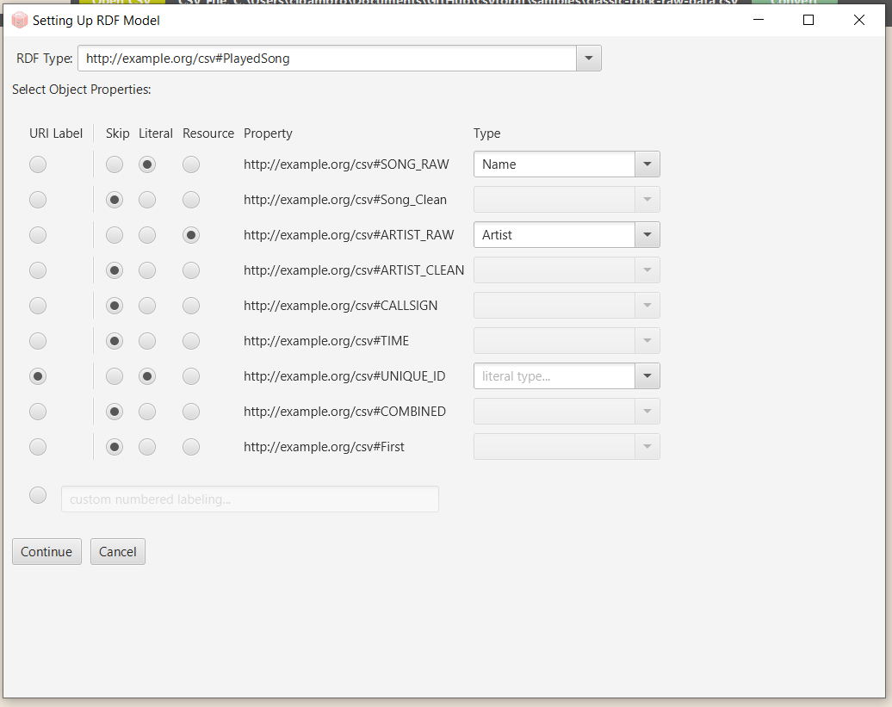

# CSV To RDF
There is an abundance of widely available data sets across the web. Unfortunately, most data sets contain their information in comma-separated values (CSV) format. The goal of this project is to create a tool for performing the migration of CSV formatted data into an RDF formatted ontology. This entails reading the CSV file, parsing headers into properties, instantiating rows as resources, and outputting the computed ontology to an RDF XML file.

## Table of Contents

- [Build](#build)
- [Run](#run)
- [Test](#testing)
- [Features](#features)
- [Protege](#protege)
  - [Build Plugin](#buildplugin)
  - [Plugin Features](#pluginfeatures)
- [Team](#team)

## Build <a name="build"></a>
### Prerequisites
- JDK 8 is installed, which includes JavaFX. If using a new JDK, JavaFX libraries will need to be added separately 

A sample script `buildrun.sh` is provided. Alternatively, this can be built manually by:
```
1. Setting CLASSPATH to include the src/ directory and lib/*
2. $ shopt -s extglob
3. $ javac src/csvtordf/main/!(CsvPlugin).java
```

## Run <a name="run"></a>
Prebuilt package has been provided and tested with JRE8.
- [csvtordf.jar](builds/csvtordf.jar)
The application can be ran by:
```
java -jar csvtordf.jar
```

If building manually, the Application can be ran by:
```
java -Dprism.order=sw csvtordf.main.CsvWizard
```
## Testing <a name="testing"></a>
The JUnit test suite can be ran by:
```
ant test
```
## Features <a name="features"></a>
### Import CSV File
> Select a CSV file to convert to RDF data. The headers will define the properties, and each subsequent row will be considered a new resource. A resource prefix may be specified as well.


### Multithreading
> Increase number of threads to potentially reduce conversion time on large data sets


### Saving
> Save the generated RDF data to an XML file


### Augmenting Input
> Augment the input data to apply to all imported resources.



The following augmentation can be made before conversion:
- **Set RDF Type** : set the RDF type to apply to each row in the CSV file.
- **Set Property Type** : each property column in the CSV file can have one of the following applied:
    - *SKIP* : Do not import this column into the RDF model.
    - *LITERAL* : The cell values for this property column contain data literals. An optional literal type may be selected for this property.
    - *RESOURCE* : The cell values for this property column refer to object resources. This will add new resources to the generated model. An optional RDF type may be specified for this property, which will be applied to all object resources of this property.
- **SET URI Labeling** : Can determine the URI labeling convention in one of two ways:
    - Selecting a property whose corresponding cell value will be used as the URI
    - Define a custom label, which will have the CSV line number appended to it

## Protege <a name="protege"></a>
Prebuilt plugin packages have been provided and tested with Protege 5.5.0. Simply place the JAR file
in the Protege plugins directory.
- Windows: [csvtordf-plugin-windows.jar](builds/csvtordf-plugin-windows.jar)
- Mac: [csvtordf-plugin-mac.jar](builds/csvtordf-plugin-mac.jar) 
- Linux: [csvtordf-plugin-linux.jar](builds/csvtordf-plugin-linux.jar)

### Build Plugin <a name="buildplugin"></a>
#### Prerequisites
- JDK8 is installed. Later versions are NOT supported!
- Protege OWL Editor is installed (only tested with Protege 5.5.0)
- ANT is installed.

A sample script `buildplugin.sh` is provided. Alternatively, this can be built manually by:
1. Setting Environment Variables
    - PROTEGE_HOME - Home directory of Protege installation
    - ANT_HOME - Home directory of Ant installation
    - JAVA_HOME - Home directory of Java installation
    - PATH - should include JDK8 and Ant in PATH
2. Copy jfxrt.jar from Protege to lib/
    - On Mac, this is typically in Protege.app/Contents/Plugins/JRE/Contents/Home/jre/lib/ext/
    - On Windows and Linux, this is typically in jre/lib/ext/
```
$ ant install -v
```

This will create the Plugin Jar and place it in the Protege plugins directory, available
when Protege is next launched.


## Plugin Features <a name="pluginfeatures"></a>
> The Plugin will be available under the Tools menu


The generated RDF triples will be imported to the current Protege Ontology, creating new instances and properties as needed.
The augmentation Wizard will allow users to select RDF types from classes defined in the Ontology. If a class is specified that does not exist, a new owl:Thing class will be created.

## Team <a name="team"></a>
- [Cody D'Ambrosio](https://github.com/cjd218)
- [Paul Grocholske](https://github.com/PGrocholske)
- [Charles Inwald](https://github.com/charlesinwald)

Contact us: [email](mailto:cjd218@lehigh.edu,pag314@lehigh.edu,cci219@lehigh.edu?subject=[GitHub]%20CSVToRDF)
